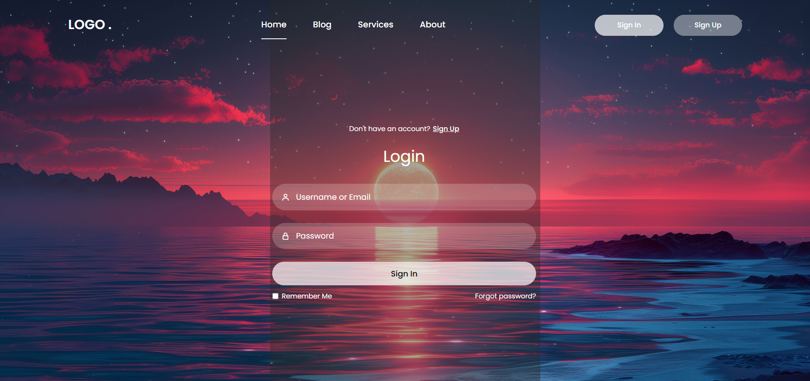

# Login-Form-117

A clean, responsive login form built with HTML, CSS and JavaScript — ideal as a starting point for small projects, demos, or learning front-end form validation and styling.

---

## Demo

*(Open `index.html` in your browser for a working demo.)*

---

## Features

- Simple, modern layout with a background image
- Client-side validation (required fields)
- Lightweight: a single HTML file (no build tools required)
- Easy to customize styles and layout

---

## Files

- `index.html` — the entire login form (HTML, CSS and JavaScript together)
- `Screenshot 2024-10-15 235044.png` — demo screenshot used in this README
- `Screenshot 2024-10-15 235841.png` — additional screenshot
- `sunset-horizon-beach-scenery-digital-art-4k-wallpaper-uhdpaper.com-151@3@a.jpg` — background image

---

## How to run

1. Clone the repository:

   git clone https://github.com/BinaryVortex/Login-Form-117.git

2. Open the project folder and double-click `index.html`, or open it in your browser (Chrome, Firefox, Edge, etc.).

No server or dependencies required.

---

## How to customize

- To change colors, spacing or fonts: edit the CSS inside `index.html`.
- To change the background image, replace the `sunset-horizon-beach-scenery-...jpg` file or update the CSS background-image URL.
- To extend validation or hook the form into a backend, add/modify the JavaScript inside `index.html`.

---

## Contributing

Contributions, suggestions and improvements are welcome. To contribute:

1. Fork the repo.
2. Create a feature branch.
3. Open a pull request describing your changes.

---

## Author

Built by BinaryVortex.

---

## License

No license specified. If you want to add one, include a `LICENSE` file in the repository (MIT is a common choice).